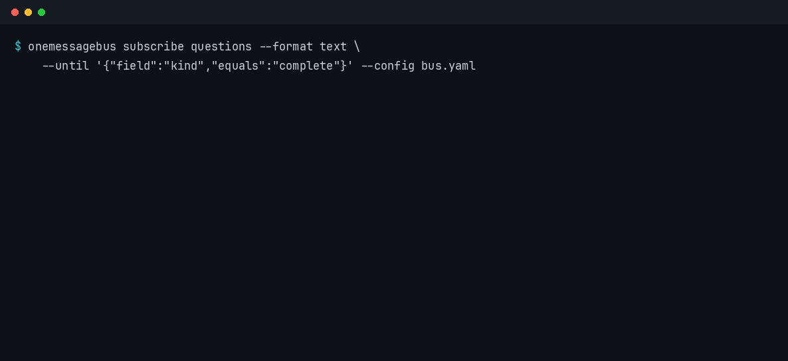
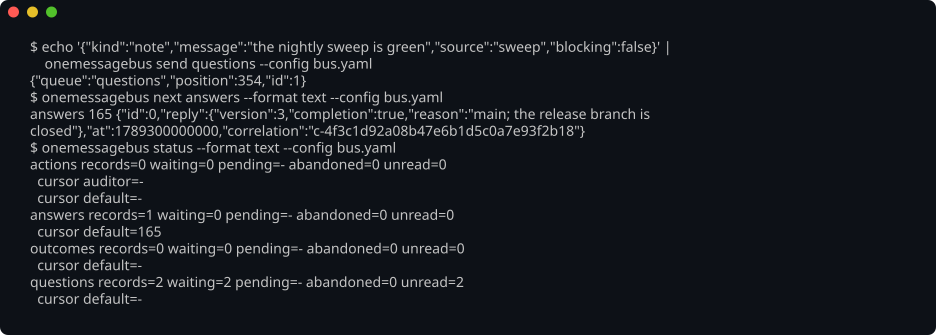
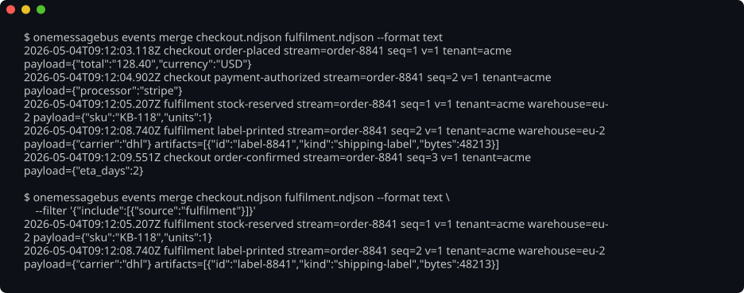
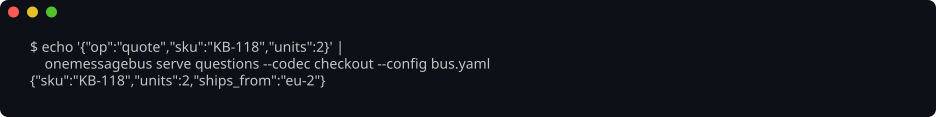

# onemessagebus



A typed NDJSON message bus for anything that speaks in events. One envelope, one filter grammar, payload bounds and
redaction, a schema registry with version read-sets, and an emitter and reader
over streams, generic over the **vocabulary** a consumer declares.

Two artifacts:

- **`onemessagebus`** — the core library. It knows the shape of an envelope and
  none of the words: which sources exist, which label keys are reserved and
  which top-level dimensions an envelope carries are a `Vocabulary`'s to
  declare. `Open` reserves nothing; a vocabulary of your own — declared in the
  program that owns it, never in the bus — is proven through the same
  conformance table.
- **`onemessagebus`**, the binary — the command line the sections below show,
  over the registry, the schema cache, NDJSON streams, the inbox and durable
  queues kept on a transport a configuration names. The local transport keeps
  each queue as plain files in one directory, and a distributed one is a plugin
  rather than a consumer change.

## Install the command line

```bash
pip install onemessagebus-cli          # PyPI wheel, no toolchain needed
npm install -g onemessagebus-cli       # npm launcher, no toolchain needed
cargo install --git https://github.com/nickderobertis/onemessagebus onemessagebus-cli --locked
```

<!-- llmlint: ignore-block[no_redundant_instruction_pointers] this README is also the PyPI page of the `onemessagebus-cli` wheel (pyproject.toml's `readme`) and the repository's front page, read by someone who has installed or found the tool and never opens AGENTS.md; these links are how that reader reaches the command line, the wire and the contract. -->
[`docs/cli.md`](docs/cli.md) is the whole command line; [`docs/wire.md`](docs/wire.md)
is the wire; [`docs/contract.md`](docs/contract.md) is the approved contract the
consumers restate from.
<!-- llmlint: ignore-end[no_redundant_instruction_pointers] -->

Every picture below is a capture of that binary run against a fixture of the
kind the end-to-end journeys stage, gated on its content hash so it cannot drift
away from what the tool prints ([`screenshots/AGENTS.md`](screenshots/AGENTS.md)).

## Queues

`send` appends a record to a queue, `next` claims one, `subscribe` tails the log
as it grows, and `status` says what each queue holds. A record is shaped by the
layout's writers, checked against its author's grants and validated against the
queue's schema before it lands, and the queue's policy — ordering, retention,
whether a claimed record is held pending an answer — is the layout's to declare
(`docs/queues.md`). The GIF above is `subscribe` on the same queue. `validate`
judges a record exactly as `send` would and appends nothing (`docs/validators.md`),
and `transports` lists the kinds this build can open — the built-in `local` and
`memory`, and every plugin on `PATH` (`docs/transport.md`).



## Ask, and the answer that echoes the correlation

`ask` raises a question and waits for the one reply that carries its
correlation. The correlation is printed on stderr the moment the question is on
the queue, so a second process can bind its `reply` to exactly that question;
between the two lines the `ask` is simply waiting, for as long as `--timeout`
allows. What it prints when the answer arrives is one JSON line carrying the
reply record (`docs/ask.md`).


## Streams

`events emit` appends one envelope to a stream file under its lock, so several
processes may write one file and leave a gapless series; `events merge` reads
any number of stream files into one stream in `(ts, stream, seq)` order.
`--filter` is the one filter grammar, inline JSON or a YAML file, and text
format renders one line per envelope. Which source words an envelope may carry
and which labels are typed how come from the vocabulary `--profile` names —
`--profile open` (the default) is the one this binary links, and it reserves
nothing.



```bash
$ echo '{"note":"hello"}' | onemessagebus events emit run.ndjson --kind note-left --stream s-1 --source billing --label tenant=acme
{"v":1,"ts":"2026-09-13T06:16:27.838Z","stream":"s-1","seq":1,"source":"billing","kind":"note-left","labels":{"tenant":"acme"},"payload":{"note":"hello"},"artifacts":[]}
```

## Schemas

`schema list` is every id this build knows: its own, whatever a `--registry`
directory holds, and every document of every bundle a configuration's `schemas`
links resolved to (`docs/schema-links.md`). `schema check` judges a payload
against one of them and names the JSON pointer of the first violation, which is
the same check a record passes on its way onto a queue. `schema register` records
a document in a `--registry` directory and `schema gen` renders one as JSON or as
Rust that regenerates it. `schemas` lists the cache those links resolve through,
and `schemas clear|fetch` empties and warms it.


## Serve a member protocol

`serve --codec` answers a configured member protocol: one frame in, one response
out, with the frame validated against the schema its codec names before any
binding runs (`docs/codecs.md`). With `--resident --socket` instead, `serve`
holds the configured transport open and answers every capability over a unix
socket — which is how both SDKs subscribe without spawning a process per call.
`deliver` and `inbox carried` are the other side of that: one message into the
spool a running receiver bound, and the store that keeps messages for a receiver
that is not running (`docs/inbox.md`).



## Exit codes are a contract

`0` did it; `1` is well-formed input whose answer is no — a payload that violates
its schema, a question nobody answered; `2` is input the verb refuses. A usage
error of `ask`, `reply` or `validate` is one line naming the verb, what was
wrong, and that verb's `--help`, with nothing of clap's own report.


## Use the library

```rust
use onemessagebus::{Emitter, Filter, Labels, Matcher, Open, Source};
use serde_json::Map;

let emitter = Emitter::<Open>::new("billing-1", Source::from("billing"), Box::new(std::io::stdout()))
    .with_labels(Labels::new().with("tenant", "acme"))
    .with_filter(Filter {
        include: Vec::new(),
        exclude: vec![Matcher::new().kind("heartbeat")],
    });
let envelope = emitter.emit("invoice-issued", Map::new());
assert_eq!(envelope.seq, 1);
```

Every wire value is a Rust type with `serde` and `schemars` derivations, and
the public API is stated in [`docs/contract.md`](docs/contract.md).

## Use the SDKs

```bash
pip install onemessagebus              # Python: import onemessagebus
npm install @onemessagebus/sdk         # TypeScript
```

Both are typed clients over the binary — one method per verb, message types
declared as a Pydantic model or with Zod's `defineMessage`, subscriptions over a
resident core — so a message defined in Python is validated by the Rust core and
read typed in TypeScript. [`docs/sdk.md`](docs/sdk.md) is the whole story.

## Develop

```bash
just bootstrap   # from a clean clone
just check       # the deterministic gate: format, lint, tests incl. the binary journeys, docs, coverage
just gate        # check plus the diff-scoped LLM-judge tier; the bar before a push
```

`AGENTS.md` is the instruction layer; `just --list` is the command surface.
